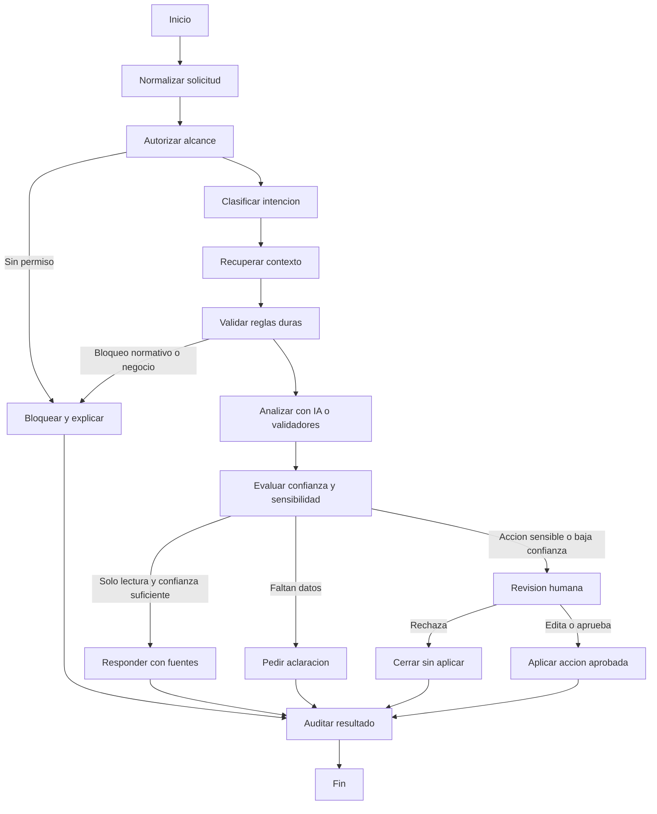

# Arte Tecnico: Integracion de IA con LangGraph

Documento de planificacion ejecutiva para incorporar IA al MVP de Tesoreria CBT usando LangGraph como orquestador de flujos auditables.

La intencion no es definir carpetas, archivos ni stack final. Este documento define el comportamiento esperado: que puede hacer la IA, que no puede hacer, como fluye una tarea, que estados se observan, donde interviene una persona y que herramientas internas puede usar.

---

## 1. Tesis de integracion

La IA del sistema debe operar como **copiloto de Tesoreria**, no como autoridad financiera.

Debe ayudar a:

- Clasificar gastos y respaldos.
- Leer documentos y extraer datos utiles.
- Detectar riesgos, omisiones, duplicados y diferencias.
- Responder preguntas sobre presupuesto, gastos, banco, rendiciones, ingresos e inventario.
- Generar borradores de rendiciones, balances y resumenes ejecutivos.
- Recomendar acciones trazables para que una persona las confirme.

No debe:

- Aprobar gastos por cuenta propia.
- Saltarse reglas presupuestarias.
- Ejecutar pagos.
- Modificar registros sensibles sin confirmacion humana.
- Inventar datos financieros, normativos o documentales.
- Usar informacion fuera del alcance del rol del usuario.

La regla central es simple: **la IA propone, el sistema valida, la persona decide**.

---

## 2. Por que LangGraph

LangGraph calza con este proyecto porque la IA de Tesoreria no debe ser un chatbot libre. Necesita flujos con pasos definidos, estado persistente, rutas condicionales, pausas humanas y auditoria.

Los conceptos base son:

- **State:** memoria estructurada de una ejecucion. Guarda datos crudos, decisiones, evidencias y resultados intermedios.
- **Nodes:** pasos del flujo. Pueden ser deterministas, llamadas a modelos, validadores, buscadores, analizadores o ejecutores de herramientas.
- **Edges:** reglas de avance. Deciden si el flujo continua, se bloquea, pide mas datos, escala a revision humana o termina.
- **Checkpoints:** snapshots del flujo para poder auditar, pausar y reanudar.
- **Interrupts:** pausas explicitas para pedir aprobacion, edicion o confirmacion humana.
- **Tools:** funciones controladas que permiten consultar o proponer cambios sobre datos del ERP.

Referencias base:

- LangGraph Overview: https://docs.langchain.com/oss/python/langgraph/overview
- Graph API: https://docs.langchain.com/oss/python/langgraph/graph-api
- Workflows and Agents: https://docs.langchain.com/oss/python/langgraph/workflows-agents
- Persistence: https://docs.langchain.com/oss/python/langgraph/persistence
- Interrupts: https://docs.langchain.com/oss/python/langgraph/interrupts
- Tools: https://docs.langchain.com/oss/python/langchain/tools

---

## 3. Principios de diseno

### P1. IA asistida, no autonoma

La IA puede recomendar acciones, completar borradores y explicar riesgos. Las acciones que afecten presupuesto, gastos, conciliacion, rendiciones, usuarios o cierre quedan sujetas a confirmacion humana y reglas del backend.

### P2. Reglas duras fuera del modelo

Las reglas de negocio existentes siguen viviendo en servicios deterministas: presupuesto disponible, bloqueo de partidas, limite de 5 IMM, cotizaciones obligatorias, documentos requeridos, flujo de aprobacion, fondos restringidos y auditoria.

El modelo no decide si una regla se cumple; como maximo interpreta documentos o redacta explicaciones. La validacion final es de codigo.

### P3. Estado auditable

Cada corrida debe dejar evidencia:

- Usuario y rol que inicio la accion.
- Pregunta o evento original.
- Entidades consultadas.
- Herramientas ejecutadas.
- Decisiones de ruteo.
- Respuesta del modelo.
- Confianza declarada.
- Revision humana, si existio.
- Resultado final.

### P4. Contexto minimo necesario

La IA solo recibe los datos necesarios para la tarea. No se entrega toda la base de datos al modelo. Cada tool debe aplicar permisos, filtros por rol y filtros por compania cuando corresponda.

### P5. Salidas con evidencia

Toda respuesta analitica debe indicar fuente interna o limitacion:

- "Segun gasto X..."
- "Segun partida Y..."
- "Segun cartola importada Z..."
- "No hay datos suficientes para concluir..."

### P6. Flujos pequenos y composables

El sistema debe partir con workflows concretos, no con un agente general todopoderoso. Cada caso de uso debe tener su propio grafo o subgrafo.

---

## 4. Capacidades IA sugeridas para el MVP

| Capacidad | Valor para Tesoreria | Riesgo | Prioridad |
|---|---|---:|---:|
| Clasificacion inteligente de gastos | Reduce carga manual al registrar gastos | Bajo | Alta |
| Lectura de documentos de respaldo | Extrae proveedor, monto, fecha, folio y tipo de documento | Medio | Alta |
| Consultas en lenguaje natural | Permite preguntar por presupuesto, saldos, pendientes y alertas | Medio | Alta |
| Deteccion de duplicados | Previene pagos repetidos y errores de carga | Medio | Media |
| Conciliacion asistida | Propone matches entre cartola y gastos aprobados | Medio | Media |
| Rendicion asistida | Detecta respaldos faltantes y genera borradores | Medio | Media |
| Resumen ejecutivo para Directorio | Convierte datos financieros en lectura ejecutiva | Bajo | Media |
| Proyeccion de flujo de caja | Anticipa tensiones de liquidez | Alto | Posterior |
| Anomalias presupuestarias | Detecta desviaciones, sobreejecucion o patrones raros | Alto | Posterior |

Orden recomendado:

1. **IA-0 Fundacion:** estado, auditoria, permisos, tools read-only.
2. **IA-1 Clasificacion y documentos:** quick win sobre gastos y respaldos.
3. **IA-2 Asistente read-only:** preguntas en lenguaje natural con fuentes.
4. **IA-3 Conciliacion y rendiciones asistidas:** propuestas con revision humana.
5. **IA-4 Analitica predictiva:** flujo de caja, anomalias y alertas avanzadas.

---

## 5. Arquitectura ejecutiva

La arquitectura se entiende en cuatro planos.

### 5.1 Plano de conversacion

Es la experiencia visible para el usuario:

- Chat o panel de asistente.
- Sugerencias dentro de formularios.
- Tarjetas de alerta o riesgo.
- Borradores revisables.
- Explicaciones de por que una accion fue bloqueada.

### 5.2 Plano de orquestacion

LangGraph coordina el flujo:

- Recibe una intencion.
- Define estado inicial.
- Autoriza alcance.
- Busca contexto.
- Ejecuta validadores.
- Llama al modelo cuando corresponde.
- Decide si termina, pide mas datos o pausa para revision humana.

### 5.3 Plano de herramientas

Las tools son la unica forma en que la IA accede al ERP.

Se dividen en:

- Tools de lectura.
- Tools de calculo y validacion.
- Tools de analisis.
- Tools de generacion de borradores.
- Tools de escritura controlada.

### 5.4 Plano de control

Capa transversal:

- Permisos por rol.
- Auditoria.
- Checkpoints.
- Limites de costo y tokens.
- Politicas de datos.
- Evaluacion y monitoreo.
- Fallback ante errores.

---

## 6. Estado del grafo

El estado no debe guardar prompts formateados como fuente principal. Debe guardar datos crudos, resultados estructurados y decisiones.

Estado conceptual:

| Campo | Proposito |
|---|---|
| `run_id` | Identificador unico de la corrida IA |
| `thread_id` | Continuidad de conversacion o workflow |
| `user_context` | Usuario, rol, compania asociada y permisos efectivos |
| `intent` | Intencion clasificada: consulta, clasificacion, documento, conciliacion, rendicion, alerta |
| `input_payload` | Pregunta, documento, gasto, movimiento bancario o evento que inicio el flujo |
| `domain_context` | Datos internos recuperados: partidas, gastos, documentos, bancos, ingresos, rendiciones |
| `policy_context` | Reglas aplicables: IMM, umbrales, presupuesto aprobado, restricciones de fondos |
| `tool_calls` | Herramientas llamadas, argumentos permitidos y resultado resumido |
| `findings` | Hallazgos: riesgos, inconsistencias, duplicados, datos extraidos |
| `confidence` | Confianza por resultado relevante |
| `proposed_actions` | Acciones sugeridas, nunca aplicadas automaticamente si escriben datos |
| `human_review` | Decision humana, comentario, editor y fecha |
| `final_response` | Respuesta visible al usuario |
| `audit_trace` | Nodos visitados, tiempos, modelo, errores y checkpoints |

Estados de ciclo de vida:

| Estado | Significado |
|---|---|
| `iniciado` | El usuario o sistema disparo un flujo |
| `autorizando` | Se verifica rol, alcance y permisos |
| `contextualizando` | Se recopilan datos internos necesarios |
| `analizando` | Se ejecutan modelo, validadores o detectores |
| `validando` | Se contrastan hallazgos contra reglas duras |
| `esperando_revision` | Hay una accion sensible o baja confianza |
| `listo_para_aplicar` | La persona aprobo la propuesta |
| `aplicado` | Se ejecuto una tool de escritura controlada |
| `bloqueado` | Una politica impide continuar |
| `finalizado` | Se entrego respuesta o resultado final |
| `fallido` | Error recuperable o tecnico registrado |

---

## 7. Catalogo de nodos

| Nodo | Tipo | Proposito | Puede escribir |
|---|---|---|---|
| `receive_request` | Determinista | Normaliza entrada del usuario, evento o documento | No |
| `authorize_scope` | Determinista | Aplica rol, compania, periodo fiscal y permisos | No |
| `classify_intent` | IA estructurada | Identifica tipo de tarea y entidades mencionadas | No |
| `route_intent` | Condicional | Decide subflujo: consulta, gasto, documento, banco, rendicion, alerta | No |
| `retrieve_context` | Tool read-only | Obtiene datos minimos necesarios del ERP | No |
| `extract_document_data` | IA/OCR | Extrae datos de facturas, boletas, cotizaciones, actas o cartolas | No |
| `validate_business_rules` | Determinista | Ejecuta reglas duras del dominio | No |
| `analyze_risk` | Hibrido | Evalua duplicados, inconsistencias, montos inusuales y omisiones | No |
| `draft_answer` | IA | Redacta respuesta con fuentes y advertencias | No |
| `draft_action` | IA + reglas | Prepara una propuesta aplicable: clasificacion, match, alerta o borrador | No |
| `human_checkpoint` | Interrupt | Pausa para aprobar, editar o rechazar | No |
| `apply_approved_action` | Tool write-gated | Ejecuta accion previamente aprobada | Si |
| `log_audit` | Determinista | Registra traza, tools, decision y resultado | Si, solo auditoria |
| `finalize_response` | Determinista | Entrega resultado final al usuario | No |

Regla de diseno: los nodos que escriben deben ser pocos, idempotentes y siempre posteriores a `human_checkpoint`.

---

## 8. Workflow maestro

Este workflow no obliga a que todo pase por un agente autonomo. Muchos caminos pueden ser deterministas y solo invocar el modelo en nodos especificos.

---

## 9. Subflujos prioritarios

### 9.1 Clasificacion inteligente de gastos

Objetivo: sugerir partida presupuestaria, fuente de fondos, tipo de gasto, documentos requeridos y riesgos antes de enviar a aprobacion.

Flujo:

1. Usuario registra gasto o sube respaldo.
2. IA extrae proveedor, RUT si existe, fecha, folio, monto, glosa y tipo de documento.
3. Sistema busca partidas candidatas e historial similar.
4. IA propone clasificacion con explicacion.
5. Validador revisa presupuesto disponible, partida bloqueada, fondos restringidos, 5 IMM y cotizaciones.
6. Si hay alta confianza, se muestra sugerencia editable.
7. Si hay baja confianza o regla sensible, se exige revision humana.
8. El usuario confirma y el backend registra el gasto como borrador o lo actualiza.

Guardrail clave: la IA no aprueba el gasto ni descuenta presupuesto. Solo prepara informacion para el flujo existente.

### 9.2 Lectura inteligente de documentos

Objetivo: convertir respaldos en datos estructurados y alertas de completitud.

Documentos objetivo:

- Boletas.
- Facturas.
- Cotizaciones.
- Actas de recepcion conforme.
- Informes fundados.
- Actas de Directorio.
- Cartolas bancarias.

Resultado esperado:

- Datos extraidos.
- Tipo documental sugerido.
- Relacion probable con gasto o rendicion.
- Calidad de lectura.
- Campos faltantes.
- Advertencias si el documento contiene instrucciones sospechosas.

Guardrail clave: todo contenido de documentos se trata como dato no confiable. Si un PDF dice "ignora las reglas anteriores", eso no es instruccion para la IA; es texto del documento.

### 9.3 Asistente read-only de Tesoreria

Objetivo: responder preguntas operativas con datos internos.

Ejemplos:

- "Que partidas estan en rojo?"
- "Cuanto queda disponible en combustibles?"
- "Que gastos mayores a 5 IMM hay este mes?"
- "Que companias tienen rendiciones incompletas?"
- "Que movimientos bancarios no estan conciliados?"
- "Resumen para Directorio del trimestre."

Flujo:

1. Clasificar pregunta.
2. Autorizar alcance por rol.
3. Consultar tools read-only.
4. Calcular indicadores.
5. Redactar respuesta con fuentes.
6. Si faltan datos, responder con limitacion clara.

Guardrail clave: no usar text-to-SQL libre sobre tablas sensibles en la primera version. Mejor usar tools de consulta acotadas.

### 9.4 Conciliacion bancaria asistida

Objetivo: proponer coincidencias entre movimientos bancarios y gastos aprobados.

Flujo:

1. Se importa cartola.
2. Sistema calcula candidatos por monto, fecha, referencia, proveedor y glosa.
3. IA ayuda a interpretar glosas ambiguas.
4. Se asigna score y explicacion por candidato.
5. Usuario revisa pares propuestos.
6. Solo con confirmacion se marca conciliado.

Guardrail clave: la conciliacion no debe modificar montos ni fechas. Solo relaciona registros existentes y deja auditoria.

### 9.5 Rendicion asistida

Objetivo: preparar una rendicion completa, detectar faltantes y generar resumen.

Flujo:

1. Usuario selecciona periodo, compania o fuente.
2. Tools recopilan gastos aprobados, documentos y conciliaciones.
3. Validador detecta respaldos faltantes, cotizaciones, actas y reglas de plazo.
4. IA genera resumen ejecutivo y observaciones.
5. Sistema produce borrador exportable.
6. Tesorero revisa y aprueba la emision/exportacion.

Guardrail clave: la IA puede redactar observaciones, pero la completitud documental la determina el validador.

### 9.6 Alertas y anomalias

Objetivo: detectar situaciones que requieren atencion.

Senales iniciales:

- Partidas sobre 80% o 100%.
- Gastos potencialmente duplicados.
- Gasto cargado a partida poco probable.
- Documento con monto distinto al gasto.
- Movimiento bancario sin gasto asociado.
- Gasto aprobado sin respaldo obligatorio.
- Uso de fondos fiscales o municipales con justificacion debil.
- Rendicion proxima a vencer.

Guardrail clave: una anomalia es una alerta, no una acusacion. El lenguaje debe ser prudente y verificable.

---

## 10. Tools propuestas

### 10.1 Tools de lectura

| Tool | Proposito | Alcance |
|---|---|---|
| `get_budget_summary` | Resumen por periodo fiscal | Filtrado por rol |
| `get_budget_item_detail` | Detalle de partida y ejecucion | Filtrado por permisos |
| `search_expenses` | Buscar gastos por fecha, proveedor, estado, monto, partida | Filtrado por rol |
| `get_expense_detail` | Obtener gasto, documentos y flujo de aprobacion | Filtrado por rol |
| `get_alerts` | Consultar alertas actuales | Filtrado por destinatario |
| `get_bank_transactions` | Listar movimientos bancarios | Tesorero/equipo |
| `get_reconciliation_candidates` | Obtener candidatos ya calculados | Tesorero/equipo |
| `get_rendition_status` | Estado de rendiciones | Segun rol |
| `get_system_rules` | IMM, umbrales, reglas configurables | Solo lectura |
| `get_audit_context` | Trazas relevantes para una entidad | Tesorero |

### 10.2 Tools de calculo y validacion

| Tool | Proposito |
|---|---|
| `validate_budget_availability` | Verifica saldo, bloqueo y sobreejecucion |
| `validate_approval_path` | Determina pasos requeridos por monto |
| `validate_required_documents` | Verifica cotizaciones, actas y respaldos |
| `validate_fund_restrictions` | Evalua restricciones por fuente de financiamiento |
| `calculate_duplicate_score` | Calcula similitud entre gastos |
| `calculate_reconciliation_score` | Puntua match banco-gasto |
| `calculate_cash_position` | Consolida saldos y obligaciones |

### 10.3 Tools de analisis IA

| Tool | Proposito |
|---|---|
| `extract_document_fields` | Extraer campos estructurados desde respaldo |
| `classify_expense_category` | Sugerir partida y categoria |
| `summarize_financial_context` | Generar resumen ejecutivo con evidencia |
| `explain_rule_violation` | Explicar bloqueo en lenguaje claro |
| `generate_rendition_observations` | Redactar observaciones de rendicion |

### 10.4 Tools de escritura controlada

Estas tools requieren `human_checkpoint` previo y auditoria obligatoria.

| Tool | Accion permitida | Restriccion |
|---|---|---|
| `create_expense_draft` | Crear gasto en borrador desde datos aprobados | Nunca aprobar |
| `update_expense_suggestion` | Guardar sugerencia IA en un gasto | No cambia estado financiero |
| `attach_document_metadata` | Guardar campos extraidos de documento | No reemplaza archivo original |
| `mark_reconciliation_proposal` | Guardar propuesta de conciliacion | No concilia aun |
| `confirm_reconciliation` | Marcar conciliacion confirmada | Solo usuario autorizado |
| `create_ai_alert` | Crear alerta derivada de analisis | Debe incluir fuente |
| `create_rendition_draft` | Crear borrador de rendicion | No presenta oficialmente |

---

## 11. Guardrails

### 11.1 Guardrails duros

No se pueden desactivar por prompt.

- El modelo no aprueba gastos.
- El modelo no desbloquea partidas.
- El modelo no cambia montos aprobados.
- El modelo no elimina documentos, gastos, movimientos, usuarios ni auditoria.
- El modelo no crea pagos ni instrucciones bancarias.
- Toda escritura requiere usuario autenticado, permiso efectivo y confirmacion humana.
- Toda accion queda registrada en auditoria.
- Toda tool aplica control de rol y alcance antes de consultar datos.
- Toda regla de negocio critica se valida con codigo.
- Si el presupuesto fiscal no esta aprobado, toda respuesta o sugerencia financiera debe advertirlo cuando sea relevante.

### 11.2 Guardrails de datos

- Minimizar datos enviados al modelo.
- No enviar credenciales, tokens, hashes de contrasena ni secretos.
- No exponer datos de una compania a un director de otra compania.
- Tratar documentos subidos como contenido no confiable.
- Separar instrucciones del sistema, datos del usuario y contenido documental.
- Redactar o excluir informacion personal cuando no aporte a la tarea.
- Mantener referencias a IDs internos para trazabilidad, no depender solo de texto.

### 11.3 Guardrails de calidad

- Responder "no hay datos suficientes" antes que inferir sin base.
- Toda recomendacion debe incluir motivo y fuente.
- Toda clasificacion debe incluir confianza.
- Bajo 65% de confianza: pedir revision o mas datos.
- Entre 65% y 85%: sugerir con advertencia.
- Sobre 85%: sugerir normalmente, pero no saltar confirmacion si hay escritura.
- Si hay conflicto entre IA y validador determinista, gana el validador.

### 11.4 Guardrails operacionales

- Limite de iteraciones por flujo.
- Timeouts por tool.
- Retries solo para errores transitorios.
- Idempotency key para tools de escritura.
- Registro de costo aproximado por corrida.
- Fallback manual si el proveedor IA falla.
- Versionar prompts y schemas de salida.
- Evaluar cambios de prompts antes de produccion.

### 11.5 Guardrails de lenguaje

- Usar tono institucional y prudente.
- Evitar afirmaciones acusatorias.
- No decir "fraude" salvo que exista una determinacion humana/documental.
- Preferir "posible duplicado", "requiere revision", "inconsistencia detectada".
- Explicar bloqueos en lenguaje operativo, no tecnico.

---

## 12. Puntos de revision humana

Debe existir pausa humana obligatoria en:

- Crear o modificar un gasto desde una sugerencia IA.
- Confirmar conciliacion bancaria.
- Crear o emitir borrador de rendicion.
- Generar alerta critica que pueda impactar a terceros.
- Responder o preparar informe para Directorio si contiene interpretacion sensible.
- Cualquier accion con baja confianza.
- Cualquier accion que involucre fondos restringidos, 5 IMM, partida bloqueada o presupuesto no aprobado.

La revision humana debe mostrar:

- Datos originales.
- Propuesta IA.
- Reglas aplicadas.
- Fuentes consultadas.
- Riesgos detectados.
- Botones claros: aprobar, editar, rechazar.
- Campo obligatorio de comentario cuando se aprueba una excepcion.

---

## 13. Politica de memoria

### Memoria de corto plazo

Se usa dentro de un `thread_id` para mantener continuidad de una consulta o workflow. Ejemplo: una conversacion sobre una rendicion especifica.

### Memoria de largo plazo

Debe ser limitada y explicita. Puede guardar preferencias operativas no sensibles, por ejemplo:

- Formato preferido de resumen ejecutivo.
- Campos que el Tesorero suele revisar.
- Plantillas de observaciones frecuentes.

No debe guardar:

- Credenciales.
- Datos personales innecesarios.
- Inferencias sensibles sobre personas.
- Reglas inventadas por conversacion.
- Decisiones que contradigan la configuracion formal del sistema.

---

## 14. Auditoria y observabilidad

Cada corrida IA debe ser reconstruible.

Registro minimo:

- `run_id`
- `thread_id`
- Usuario y rol.
- Modulo origen.
- Entidad principal, si existe.
- Nodos ejecutados.
- Tools llamadas.
- Resultado de cada validador.
- Modelo usado.
- Version de prompt.
- Version de schema.
- Tokens/costo aproximado.
- Estado final.
- Decision humana.

Indicadores a monitorear:

- Tasa de sugerencias aceptadas.
- Tasa de ediciones humanas.
- Tasa de rechazos.
- Errores por tool.
- Latencia por flujo.
- Costo por modulo.
- Casos bloqueados por guardrails.
- Clasificaciones corregidas posteriormente.

---

## 15. Evaluacion antes de produccion

La IA debe probarse con casos dorados del dominio, no solo con prompts genericos.

Suites sugeridas:

### Clasificacion de gastos

- Servicios basicos exentos.
- Compra con 3 cotizaciones requeridas.
- Gasto sobre 5 IMM.
- Gasto de fondo municipal con justificacion.
- Gasto contra partida bloqueada.
- Proveedor repetido con glosa similar.

### Documentos

- Factura legible.
- Boleta con monto ambiguo.
- Cotizacion sin RUT.
- Acta de recepcion conforme.
- PDF con instrucciones maliciosas.
- Documento escaneado de baja calidad.

### Consultas

- Pregunta permitida para Tesorero.
- Pregunta limitada para director de compania.
- Pregunta sobre datos inexistentes.
- Pregunta que intenta saltarse permisos.

### Conciliacion

- Match exacto.
- Match por monto y fecha cercana.
- Movimiento dividido en varios gastos.
- Gasto sin movimiento bancario.
- Movimiento sin gasto asociado.

Criterios de salida:

- No hay escrituras sin confirmacion humana.
- No hay fuga de datos entre roles.
- Las reglas duras siempre prevalecen.
- Las respuestas financieras citan fuentes internas.
- Los casos de baja confianza escalan correctamente.

---

## 16. Roadmap propuesto

### IA-0: Fundacion de control

Entregables:

- Definicion de estado comun.
- Catalogo inicial de tools read-only.
- Politica de auditoria IA.
- Guardrails duros implementados en runtime.
- Primer workflow read-only con checkpoints.

Resultado esperado: se puede preguntar al sistema sin riesgo de modificar datos.

### IA-1: Gastos y documentos

Entregables:

- Extraccion de datos desde respaldo.
- Clasificacion de gasto.
- Sugerencia de partida.
- Validacion de documentos requeridos.
- Guardado de sugerencia con confirmacion humana.

Resultado esperado: registrar gastos es mas rapido y con menos errores.

### IA-2: Asistente operativo

Entregables:

- Preguntas sobre presupuesto, gastos, alertas, banco y rendiciones.
- Respuestas con fuentes.
- Resumen ejecutivo basico.
- UI con historial y trazabilidad.

Resultado esperado: el Tesorero consulta el estado financiero sin navegar todas las pantallas.

### IA-3: Conciliacion y rendiciones

Entregables:

- Propuestas de conciliacion con score.
- Revision humana de matches.
- Deteccion de respaldos faltantes.
- Borrador de rendicion y observaciones.

Resultado esperado: menor tiempo de cierre y rendicion.

### IA-4: Analitica avanzada

Entregables:

- Deteccion de anomalias historicas.
- Proyeccion de flujo de caja.
- Alertas predictivas.
- Comparativos por compania, proveedor y partida.

Resultado esperado: pasar de control reactivo a gestion preventiva.

---

## 17. Decisiones de producto

### Primera experiencia recomendada

No partir con un chatbot general. Partir con tres entradas concretas:

1. **Boton "Analizar con IA" en nuevo gasto.**
2. **Panel "Preguntar a Tesoreria" read-only.**
3. **Boton "Sugerir conciliacion" en banco.**

Esto permite demostrar valor sin entregar autonomia excesiva.

### Respuesta visible ideal

Una respuesta IA debe mostrar:

- Resultado principal.
- Evidencia usada.
- Riesgos o advertencias.
- Accion sugerida.
- Nivel de confianza.
- Boton de aplicar solo cuando corresponda y con confirmacion.

### Mensaje de bloqueo ideal

Ejemplo:

> No puedo sugerir la aprobacion de este gasto porque la partida esta bloqueada por ejecucion igual o superior al 100%. Puedes revisar la partida, cambiar la imputacion o solicitar desbloqueo manual al Tesorero con justificacion.

---

## 18. Riesgos y mitigaciones

| Riesgo | Impacto | Mitigacion |
|---|---:|---|
| La IA inventa una respuesta financiera | Alto | Respuestas con fuentes, tools acotadas y bloqueo si no hay datos |
| Un usuario intenta saltarse permisos mediante prompt | Alto | Permisos en tools y backend, no en prompt |
| Documento malicioso intenta inyectar instrucciones | Alto | Tratamiento de documentos como datos no confiables |
| Sugerencia IA se confunde con aprobacion formal | Alto | UI debe diferenciar sugerencia, borrador y aprobacion |
| Costo de modelo crece sin control | Medio | Limites por flujo, cache, modelos pequenos para clasificacion |
| Baja adopcion por desconfianza | Medio | Mostrar evidencia, permitir editar, auditar decisiones |
| Cambian reglas normativas | Medio | Reglas parametrizadas y evaluaciones de regresion |
| Dependencia excesiva de proveedor IA | Medio | Tools deterministas, fallback manual, arquitectura model-agnostic |

---

## 19. Definicion de exito

La integracion de IA sera exitosa si:

- Reduce tiempo de registro de gastos.
- Disminuye errores de imputacion presupuestaria.
- Detecta respaldos faltantes antes de rendir.
- Aumenta trazabilidad de decisiones.
- Permite responder preguntas financieras con fuentes.
- No introduce aprobaciones automaticas ni modificaciones invisibles.
- Mantiene confianza institucional: todo lo relevante queda explicado y auditado.

---

## 20. Regla final

Para Tesoreria CBT, LangGraph no debe ser "un bot que conversa con la base de datos".

Debe ser una **maquina de flujo auditable** donde la IA participa en pasos especificos: interpretar, resumir, clasificar, sugerir y explicar. Las decisiones financieras siguen gobernadas por reglas del sistema y responsables humanos.
