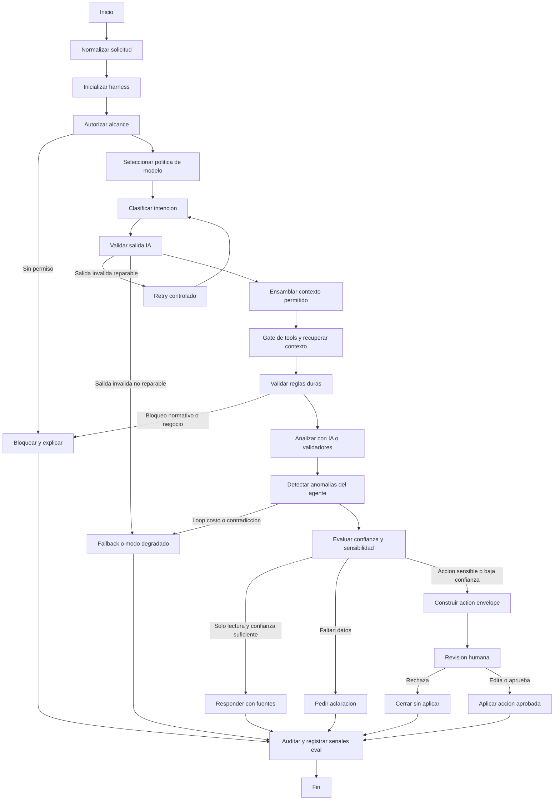

# Arte Tecnico: Integracion de IA con LangGraph

Documento de planificacion ejecutiva para incorporar IA al MVP de Tesoreria CBT usando LangGraph como orquestador de flujos auditables.

La intencion no es definir carpetas, archivos ni stack final. Este documento define el comportamiento esperado: que puede hacer la IA, que no puede hacer, como fluye una tarea, que estados se observan, donde interviene una persona y que herramientas internas puede usar.

---

## 1. Tesis de integracion

La IA del sistema debe operar como **copiloto de Tesoreria**, no como autoridad financiera.

Debe ayudar a:

- Clasificar gastos y respaldos.
- Leer documentos y extraer datos utiles.
- Detectar riesgos, omisiones, duplicados y diferencias.
- Responder preguntas sobre presupuesto, gastos, banco, rendiciones, ingresos e inventario.
- Generar borradores de rendiciones, balances y resumenes ejecutivos.
- Recomendar acciones trazables para que una persona las confirme.

No debe:

- Aprobar gastos por cuenta propia.
- Saltarse reglas presupuestarias.
- Ejecutar pagos.
- Modificar registros sensibles sin confirmacion humana.
- Inventar datos financieros, normativos o documentales.
- Usar informacion fuera del alcance del rol del usuario.

La regla central es simple: **la IA propone, el sistema valida, la persona decide**.

---

## 2. Por que LangGraph

LangGraph calza con este proyecto porque la IA de Tesoreria no debe ser un chatbot libre. Necesita flujos con pasos definidos, estado persistente, rutas condicionales, pausas humanas y auditoria.

Los conceptos base son:

- **State:** memoria estructurada de una ejecucion. Guarda datos crudos, decisiones, evidencias y resultados intermedios.
- **Nodes:** pasos del flujo. Pueden ser deterministas, llamadas a modelos, validadores, buscadores, analizadores o ejecutores de herramientas.
- **Edges:** reglas de avance. Deciden si el flujo continua, se bloquea, pide mas datos, escala a revision humana o termina.
- **Checkpoints:** snapshots del flujo para poder auditar, pausar y reanudar.
- **Interrupts:** pausas explicitas para pedir aprobacion, edicion o confirmacion humana.
- **Tools:** funciones controladas que permiten consultar o proponer cambios sobre datos del ERP.

Referencias base:

- LangGraph Overview: https://docs.langchain.com/oss/python/langgraph/overview
- Graph API: https://docs.langchain.com/oss/python/langgraph/graph-api
- Workflows and Agents: https://docs.langchain.com/oss/python/langgraph/workflows-agents
- Persistence: https://docs.langchain.com/oss/python/langgraph/persistence
- Interrupts: https://docs.langchain.com/oss/python/langgraph/interrupts
- Tools: https://docs.langchain.com/oss/python/langchain/tools

---

## 3. Principios de diseno

### P1. IA asistida, no autonoma

La IA puede recomendar acciones, completar borradores y explicar riesgos. Las acciones que afecten presupuesto, gastos, conciliacion, rendiciones, usuarios o cierre quedan sujetas a confirmacion humana y reglas del backend.

### P2. Reglas duras fuera del modelo

Las reglas de negocio existentes siguen viviendo en servicios deterministas: presupuesto disponible, bloqueo de partidas, limite de 5 IMM, cotizaciones obligatorias, documentos requeridos, flujo de aprobacion, fondos restringidos y auditoria.

El modelo no decide si una regla se cumple; como maximo interpreta documentos o redacta explicaciones. La validacion final es de codigo.

### P3. Estado auditable

Cada corrida debe dejar evidencia:

- Usuario y rol que inicio la accion.
- Pregunta o evento original.
- Entidades consultadas.
- Herramientas ejecutadas.
- Decisiones de ruteo.
- Respuesta del modelo.
- Confianza declarada.
- Revision humana, si existio.
- Resultado final.

### P4. Contexto minimo necesario

La IA solo recibe los datos necesarios para la tarea. No se entrega toda la base de datos al modelo. Cada tool debe aplicar permisos, filtros por rol y filtros por compania cuando corresponda.

### P5. Salidas con evidencia

Toda respuesta analitica debe indicar fuente interna o limitacion:

- "Segun gasto X..."
- "Segun partida Y..."
- "Segun cartola importada Z..."
- "No hay datos suficientes para concluir..."

### P6. Flujos pequenos y composables

El sistema debe partir con workflows concretos, no con un agente general todopoderoso. Cada caso de uso debe tener su propio grafo o subgrafo.

---

## 4. Capacidades IA sugeridas para el MVP

| Capacidad | Valor para Tesoreria | Riesgo | Prioridad |
|---|---|---:|---:|
| Clasificacion inteligente de gastos | Reduce carga manual al registrar gastos | Bajo | Alta |
| Lectura de documentos de respaldo | Extrae proveedor, monto, fecha, folio y tipo de documento | Medio | Alta |
| Consultas en lenguaje natural | Permite preguntar por presupuesto, saldos, pendientes y alertas | Medio | Alta |
| Deteccion de duplicados | Previene pagos repetidos y errores de carga | Medio | Media |
| Conciliacion asistida | Propone matches entre cartola y gastos aprobados | Medio | Media |
| Rendicion asistida | Detecta respaldos faltantes y genera borradores | Medio | Media |
| Resumen ejecutivo para Directorio | Convierte datos financieros en lectura ejecutiva | Bajo | Media |
| Proyeccion de flujo de caja | Anticipa tensiones de liquidez | Alto | Posterior |
| Anomalias presupuestarias | Detecta desviaciones, sobreejecucion o patrones raros | Alto | Posterior |

Orden recomendado:

1. **IA-0 Fundacion:** estado, auditoria, permisos, tools read-only.
2. **IA-1 Clasificacion y documentos:** quick win sobre gastos y respaldos.
3. **IA-2 Asistente read-only:** preguntas en lenguaje natural con fuentes.
4. **IA-3 Conciliacion y rendiciones asistidas:** propuestas con revision humana.
5. **IA-4 Analitica predictiva:** flujo de caja, anomalias y alertas avanzadas.

---

## 5. Arquitectura ejecutiva

La arquitectura se entiende en cuatro planos.

### 5.1 Plano de conversacion

Es la experiencia visible para el usuario:

- Chat o panel de asistente.
- Sugerencias dentro de formularios.
- Tarjetas de alerta o riesgo.
- Borradores revisables.
- Explicaciones de por que una accion fue bloqueada.

### 5.2 Plano de orquestacion

LangGraph coordina el flujo:

- Recibe una intencion.
- Define estado inicial.
- Autoriza alcance.
- Busca contexto.
- Ejecuta validadores.
- Llama al modelo cuando corresponde.
- Decide si termina, pide mas datos o pausa para revision humana.

### 5.3 Plano de herramientas

Las tools son la unica forma en que la IA accede al ERP.

Se dividen en:

- Tools de lectura.
- Tools de calculo y validacion.
- Tools de analisis.
- Tools de generacion de borradores.
- Tools de escritura controlada.

### 5.4 Plano de control

Capa transversal:

- Permisos por rol.
- Auditoria.
- Checkpoints.
- Limites de costo y tokens.
- Politicas de datos.
- Evaluacion y monitoreo.
- Fallback ante errores.

### 5.5 Capa de Agent Harness

El **Agent Harness** es la capa de control que envuelve las llamadas al modelo, la ejecucion de tools y el avance del grafo. LangGraph orquesta el flujo; el harness impone presupuestos, politicas, validaciones y criterios de salida en cada paso.

Separacion de responsabilidades:

| Capa | Responsabilidad | No debe decidir |
|---|---|---|
| LLM | Interpretar texto, extraer campos, clasificar, resumir y redactar explicaciones | Permisos, aprobaciones, reglas financieras, escrituras |
| LangGraph | Definir nodos, edges, checkpoints, interrupts y reanudacion de workflows | Si una regla de negocio se cumple, si una escritura es valida |
| Agent Harness | Controlar presupuesto, modelo, tools, contexto, salidas, retries, fallback y anomalias | La verdad financiera ni la autorizacion final |
| Backend determinista | Autenticacion, autorizacion, reglas de negocio, transacciones, auditoria y escrituras | Interpretacion libre de documentos o lenguaje natural |

Responsabilidades del harness:

- Seleccionar politica de modelo por flujo, riesgo y costo.
- Aplicar limites de tokens, costo, tiempo, iteraciones y cantidad de tool calls.
- Construir el contexto permitido antes de llamar al modelo.
- Validar que la salida del modelo cumpla schemas estrictos.
- Verificar que cada tool call este permitida para el flujo, rol, entidad y estado actual.
- Deduplicar tool calls redundantes y bloquear loops de razonamiento/tool use.
- Separar contenido no confiable de documentos, mensajes de usuario e instrucciones del sistema.
- Detectar contradicciones entre respuesta IA, fuentes recuperadas y validadores.
- Activar fallback, degradacion read-only o revision humana cuando el modelo falla o baja la confianza.
- Registrar trazas tecnicas para Langfuse y trazas operativas en `ai_runs`/`audit_log`.

Que controla:

- **LLM:** proveedor/modelo permitido, temperatura, schema, prompt versionado, retries de salida invalida y fallback.
- **Tools:** allowlist por flujo, argumentos permitidos, limites por run, idempotencia, permisos efectivos y bloqueo de escrituras sin checkpoint humano.
- **Flujo:** maximo de pasos, rutas bloqueadas, escalamiento a humano, cancelacion por presupuesto o anomalia.
- **Contexto:** seleccion, redaccion, frescura, volumen, fuentes obligatorias y exclusion de datos fuera de alcance.

Que no controla:

- No reemplaza RBAC ni permisos del backend.
- No calcula reglas criticas de presupuesto como fuente de verdad.
- No aprueba gastos, pagos, conciliaciones ni rendiciones.
- No modifica registros financieros directamente.
- No sustituye `audit_log` ni los logs obligatorios del ERP.

Interaccion con LangGraph:

- El harness se ejecuta como middleware o nodos deterministas alrededor de nodos IA y nodos tool.
- Antes de cada llamada LLM: valida politica de modelo, presupuesto y contexto.
- Antes de cada tool: valida allowlist, permisos, argumentos y estado del grafo.
- Despues de cada nodo IA: valida schema, fuentes, confianza y contradicciones.
- En edges condicionales: entrega flags como `requires_human_review`, `blocked_by_policy`, `retryable_error`, `degraded_mode` o `anomaly_detected`.

Interaccion con backend y reglas deterministas:

- El backend es la autoridad para permisos, reglas de negocio, transacciones y escritura.
- Las tools deben llamar servicios existentes del backend, no consultas libres generadas por el modelo.
- Toda escritura usa un `action_envelope` validado: entidad, accion, diff propuesto, fuentes, reglas ejecutadas, aprobador humano, idempotency key y version de comportamiento.
- El backend re-ejecuta validadores criticos al aplicar la accion, aunque el grafo ya los haya ejecutado.

---

## 6. Estado del grafo

El estado no debe guardar prompts formateados como fuente principal. Debe guardar datos crudos, resultados estructurados y decisiones.

Estado conceptual:

| Campo | Proposito |
|---|---|
| `run_id` | Identificador unico de la corrida IA |
| `thread_id` | Continuidad de conversacion o workflow |
| `graph_version` | Version del grafo o subgrafo ejecutado |
| `agent_behavior_version` | Version compuesta de prompts, schemas, tools, politicas y modelo |
| `user_context` | Usuario, rol, compania asociada y permisos efectivos |
| `intent` | Intencion clasificada: consulta, clasificacion, documento, conciliacion, rendicion, alerta |
| `input_payload` | Pregunta, documento, gasto, movimiento bancario o evento que inicio el flujo |
| `model_policy` | Modelo primario, fallback permitido, temperatura, schema y limites aplicables |
| `execution_budget` | Limites de tokens, costo, duracion, iteraciones y tool calls |
| `context_budget` | Presupuesto de contexto, reglas de seleccion, fuentes incluidas y datos excluidos |
| `tool_policy` | Allowlist por flujo, argumentos permitidos, permisos y modo read/write |
| `domain_context` | Datos internos recuperados: partidas, gastos, documentos, bancos, ingresos, rendiciones |
| `policy_context` | Reglas aplicables: IMM, umbrales, presupuesto aprobado, restricciones de fondos |
| `tool_calls` | Herramientas llamadas, argumentos permitidos y resultado resumido |
| `findings` | Hallazgos: riesgos, inconsistencias, duplicados, datos extraidos |
| `risk_flags` | Flags del harness: prompt injection, source mismatch, loop, costo alto, baja confianza |
| `confidence` | Confianza por resultado relevante |
| `proposed_actions` | Acciones sugeridas, nunca aplicadas automaticamente si escriben datos |
| `action_envelope` | Paquete validado para accion sensible: diff, fuentes, reglas, aprobador e idempotencia |
| `human_review` | Decision humana, comentario, editor y fecha |
| `final_response` | Respuesta visible al usuario |
| `fallback_path` | Fallback aplicado: modelo alternativo, modo degradado, manual o bloqueo |
| `eval_tags` | Tags para evals y monitoreo: modulo, caso, version, riesgo y criticidad |
| `audit_trace` | Nodos visitados, tiempos, modelo, errores y checkpoints |

Estados de ciclo de vida:

| Estado | Significado |
|---|---|
| `iniciado` | El usuario o sistema disparo un flujo |
| `autorizando` | Se verifica rol, alcance y permisos |
| `configurando_harness` | Se fija version, modelo, presupuesto, allowlist y politica de contexto |
| `contextualizando` | Se recopilan datos internos necesarios |
| `analizando` | Se ejecutan modelo, validadores o detectores |
| `validando` | Se contrastan hallazgos contra reglas duras |
| `reintentando` | Se reintenta un paso por error transitorio o salida estructurada reparable |
| `degradado` | El flujo continua en modo limitado, normalmente read-only o sin LLM |
| `requiere_aclaracion` | La entrada o el contexto son insuficientes para responder con evidencia |
| `esperando_revision` | Hay una accion sensible o baja confianza |
| `listo_para_aplicar` | La persona aprobo la propuesta |
| `aplicado` | Se ejecuto una tool de escritura controlada |
| `bloqueado` | Una politica impide continuar |
| `cancelado_por_limite` | El harness detuvo la corrida por costo, tiempo, iteraciones o tool calls |
| `error_agente` | Error de comportamiento IA: schema invalido, tool no permitida, loop o contradiccion |
| `finalizado` | Se entrego respuesta o resultado final |
| `fallido` | Error recuperable o tecnico registrado |

---

## 7. Catalogo de nodos

| Nodo | Tipo | Proposito | Puede escribir |
|---|---|---|---|
| `receive_request` | Determinista | Normaliza entrada del usuario, evento o documento | No |
| `authorize_scope` | Determinista | Aplica rol, compania, periodo fiscal y permisos | No |
| `initialize_harness` | Harness | Fija version, presupuesto, politica de modelo, allowlist y limites del flujo | No |
| `select_model_policy` | Harness | Selecciona modelo primario, fallback, temperatura y schema por riesgo/costo | No |
| `classify_intent` | IA estructurada | Identifica tipo de tarea y entidades mencionadas | No |
| `validate_llm_output` | Determinista | Valida JSON/schema, campos obligatorios, fuentes y confianza declarada | No |
| `route_intent` | Condicional | Decide subflujo: consulta, gasto, documento, banco, rendicion, alerta | No |
| `assemble_context` | Harness | Selecciona contexto minimo, fuentes, redacciones y datos excluidos | No |
| `retrieve_context` | Tool read-only | Obtiene datos minimos necesarios del ERP | No |
| `tool_policy_gate` | Harness | Autoriza o bloquea tool calls por flujo, rol, entidad, argumentos y presupuesto | No |
| `extract_document_data` | IA/OCR | Extrae datos de facturas, boletas, cotizaciones, actas o cartolas | No |
| `validate_business_rules` | Determinista | Ejecuta reglas duras del dominio | No |
| `analyze_risk` | Hibrido | Evalua duplicados, inconsistencias, montos inusuales y omisiones | No |
| `detect_agent_anomaly` | Harness | Detecta loops, tool abuse, costo anormal, contradicciones y source mismatch | No |
| `draft_answer` | IA | Redacta respuesta con fuentes y advertencias | No |
| `draft_action` | IA + reglas | Prepara una propuesta aplicable: clasificacion, match, alerta o borrador | No |
| `build_action_envelope` | Determinista | Construye diff aplicable con fuentes, reglas, aprobador requerido e idempotencia | No |
| `human_checkpoint` | Interrupt | Pausa para aprobar, editar o rechazar | No |
| `apply_approved_action` | Tool write-gated | Ejecuta accion previamente aprobada | Si |
| `fallback_or_degrade` | Condicional | Cambia de modelo, pasa a modo read-only/manual o bloquea con explicacion | No |
| `record_eval_signal` | Determinista | Registra metricas, labels y senales para evals continuas | Si, solo auditoria IA |
| `log_audit` | Determinista | Registra traza, tools, decision y resultado | Si, solo auditoria |
| `finalize_response` | Determinista | Entrega resultado final al usuario | No |

Regla de diseno: los nodos que escriben deben ser pocos, idempotentes y siempre posteriores a `human_checkpoint`. Ademas, ningun nodo IA puede llamar tools directamente; toda llamada pasa por `tool_policy_gate` y toda salida IA que afecte ruteo o propuesta pasa por `validate_llm_output`.

---

## 8. Workflow maestro

Este workflow no obliga a que todo pase por un agente autonomo. Muchos caminos pueden ser deterministas y solo invocar el modelo en nodos especificos.

---

## 9. Subflujos prioritarios

### 9.1 Clasificacion inteligente de gastos

Objetivo: sugerir partida presupuestaria, fuente de fondos, tipo de gasto, documentos requeridos y riesgos antes de enviar a aprobacion.

Flujo:

1. Usuario registra gasto o sube respaldo.
2. IA extrae proveedor, RUT si existe, fecha, folio, monto, glosa y tipo de documento.
3. Sistema busca partidas candidatas e historial similar.
4. IA propone clasificacion con explicacion.
5. Validador revisa presupuesto disponible, partida bloqueada, fondos restringidos, 5 IMM y cotizaciones.
6. Si hay alta confianza, se muestra sugerencia editable.
7. Si hay baja confianza o regla sensible, se exige revision humana.
8. El usuario confirma y el backend registra el gasto como borrador o lo actualiza.

Guardrail clave: la IA no aprueba el gasto ni descuenta presupuesto. Solo prepara informacion para el flujo existente.

### 9.2 Lectura inteligente de documentos

Objetivo: convertir respaldos en datos estructurados y alertas de completitud.

Documentos objetivo:

- Boletas.
- Facturas.
- Cotizaciones.
- Actas de recepcion conforme.
- Informes fundados.
- Actas de Directorio.
- Cartolas bancarias.

Resultado esperado:

- Datos extraidos.
- Tipo documental sugerido.
- Relacion probable con gasto o rendicion.
- Calidad de lectura.
- Campos faltantes.
- Advertencias si el documento contiene instrucciones sospechosas.

Guardrail clave: todo contenido de documentos se trata como dato no confiable. Si un PDF dice "ignora las reglas anteriores", eso no es instruccion para la IA; es texto del documento.

### 9.3 Asistente read-only de Tesoreria

Objetivo: responder preguntas operativas con datos internos.

Ejemplos:

- "Que partidas estan en rojo?"
- "Cuanto queda disponible en combustibles?"
- "Que gastos mayores a 5 IMM hay este mes?"
- "Que companias tienen rendiciones incompletas?"
- "Que movimientos bancarios no estan conciliados?"
- "Resumen para Directorio del trimestre."

Flujo:

1. Clasificar pregunta.
2. Autorizar alcance por rol.
3. Consultar tools read-only.
4. Calcular indicadores.
5. Redactar respuesta con fuentes.
6. Si faltan datos, responder con limitacion clara.

Guardrail clave: no usar text-to-SQL libre sobre tablas sensibles en la primera version. Mejor usar tools de consulta acotadas.

### 9.4 Conciliacion bancaria asistida

Objetivo: proponer coincidencias entre movimientos bancarios y gastos aprobados.

Flujo:

1. Se importa cartola.
2. Sistema calcula candidatos por monto, fecha, referencia, proveedor y glosa.
3. IA ayuda a interpretar glosas ambiguas.
4. Se asigna score y explicacion por candidato.
5. Usuario revisa pares propuestos.
6. Solo con confirmacion se marca conciliado.

Guardrail clave: la conciliacion no debe modificar montos ni fechas. Solo relaciona registros existentes y deja auditoria.

### 9.5 Rendicion asistida

Objetivo: preparar una rendicion completa, detectar faltantes y generar resumen.

Flujo:

1. Usuario selecciona periodo, compania o fuente.
2. Tools recopilan gastos aprobados, documentos y conciliaciones.
3. Validador detecta respaldos faltantes, cotizaciones, actas y reglas de plazo.
4. IA genera resumen ejecutivo y observaciones.
5. Sistema produce borrador exportable.
6. Tesorero revisa y aprueba la emision/exportacion.

Guardrail clave: la IA puede redactar observaciones, pero la completitud documental la determina el validador.

### 9.6 Alertas y anomalias

Objetivo: detectar situaciones que requieren atencion.

Senales iniciales:

- Partidas sobre 80% o 100%.
- Gastos potencialmente duplicados.
- Gasto cargado a partida poco probable.
- Documento con monto distinto al gasto.
- Movimiento bancario sin gasto asociado.
- Gasto aprobado sin respaldo obligatorio.
- Uso de fondos fiscales o municipales con justificacion debil.
- Rendicion proxima a vencer.

Guardrail clave: una anomalia es una alerta, no una acusacion. El lenguaje debe ser prudente y verificable.

---

## 10. Tools propuestas

### 10.1 Tools de lectura

| Tool | Proposito | Alcance |
|---|---|---|
| `get_budget_summary` | Resumen por periodo fiscal | Filtrado por rol |
| `get_budget_item_detail` | Detalle de partida y ejecucion | Filtrado por permisos |
| `search_expenses` | Buscar gastos por fecha, proveedor, estado, monto, partida | Filtrado por rol |
| `get_expense_detail` | Obtener gasto, documentos y flujo de aprobacion | Filtrado por rol |
| `get_alerts` | Consultar alertas actuales | Filtrado por destinatario |
| `get_bank_transactions` | Listar movimientos bancarios | Tesorero/equipo |
| `get_reconciliation_candidates` | Obtener candidatos ya calculados | Tesorero/equipo |
| `get_rendition_status` | Estado de rendiciones | Segun rol |
| `get_system_rules` | IMM, umbrales, reglas configurables | Solo lectura |
| `get_audit_context` | Trazas relevantes para una entidad | Tesorero |

### 10.2 Tools de calculo y validacion

| Tool | Proposito |
|---|---|
| `validate_budget_availability` | Verifica saldo, bloqueo y sobreejecucion |
| `validate_approval_path` | Determina pasos requeridos por monto |
| `validate_required_documents` | Verifica cotizaciones, actas y respaldos |
| `validate_fund_restrictions` | Evalua restricciones por fuente de financiamiento |
| `calculate_duplicate_score` | Calcula similitud entre gastos |
| `calculate_reconciliation_score` | Puntua match banco-gasto |
| `calculate_cash_position` | Consolida saldos y obligaciones |

### 10.3 Tools de analisis IA

| Tool | Proposito |
|---|---|
| `extract_document_fields` | Extraer campos estructurados desde respaldo |
| `classify_expense_category` | Sugerir partida y categoria |
| `summarize_financial_context` | Generar resumen ejecutivo con evidencia |
| `explain_rule_violation` | Explicar bloqueo en lenguaje claro |
| `generate_rendition_observations` | Redactar observaciones de rendicion |

### 10.4 Tools de escritura controlada

Estas tools requieren `human_checkpoint` previo y auditoria obligatoria.

| Tool | Accion permitida | Restriccion |
|---|---|---|
| `create_expense_draft` | Crear gasto en borrador desde datos aprobados | Nunca aprobar |
| `update_expense_suggestion` | Guardar sugerencia IA en un gasto | No cambia estado financiero |
| `attach_document_metadata` | Guardar campos extraidos de documento | No reemplaza archivo original |
| `mark_reconciliation_proposal` | Guardar propuesta de conciliacion | No concilia aun |
| `confirm_reconciliation` | Marcar conciliacion confirmada | Solo usuario autorizado |
| `create_ai_alert` | Crear alerta derivada de analisis | Debe incluir fuente |
| `create_rendition_draft` | Crear borrador de rendicion | No presenta oficialmente |

### 10.5 Registro y politicas de tools

Cada tool debe registrarse con metadatos ejecutables, no solo documentales:

| Campo | Uso operacional |
|---|---|
| `tool_name` | Nombre estable y versionado |
| `tool_version` | Version compatible con `agent_behavior_version` |
| `mode` | `read_only`, `validator`, `analysis`, `draft`, `write_gated` |
| `allowed_flows` | Subflujos donde se puede usar |
| `required_roles` | Roles minimos y permisos efectivos |
| `input_schema` | Schema estricto de argumentos permitidos |
| `output_schema` | Schema estricto de resultado resumible y auditable |
| `timeout_ms` | Timeout especifico por tool |
| `max_calls_per_run` | Limite por corrida |
| `idempotent` | Requisito obligatorio para escritura |
| `sensitive_entities` | Entidades protegidas que requieren revision o redaccion |

Politicas obligatorias:

- El modelo nunca recibe una tool generica de SQL, shell, HTTP libre o escritura arbitraria.
- La allowlist de tools se calcula por flujo antes de llamar al modelo.
- Toda tool valida rol y alcance en backend, aunque el harness ya lo haya validado.
- Toda llamada repite `run_id`, `thread_id`, `user_context`, `agent_behavior_version` y `idempotency_key` cuando corresponda.
- El harness bloquea llamadas con argumentos fuera de schema, entidades fuera de alcance o cambios no representados en `action_envelope`.
- Se deduplican llamadas equivalentes dentro de una misma corrida para evitar loops y costos innecesarios.
- Una tool de escritura no puede ser llamada en el mismo nodo donde se genero la propuesta IA.
- Tools de escritura deben soportar dry-run o prevalidacion antes de aplicar cambios.

Control de loops y abuso:

| Senal | Accion del harness |
|---|---|
| Misma tool con mismos argumentos mas de 1 vez | Reusar resultado cacheado o bloquear repeticion |
| Mas de 3 tools de lectura en una consulta simple | Re-evaluar plan o pedir aclaracion |
| Mas de 2 intentos de reparacion de schema | Pasar a fallback o revision humana |
| Tool propuesta fuera de allowlist | Bloquear, registrar `error_agente` y no ejecutar |
| Argumentos amplios sin filtro temporal/rol/entidad | Rechazar y pedir parametros especificos |
| Modelo insiste en escribir sin checkpoint | Bloquear corrida y registrar anomalia critica |

---

## 11. Guardrails

### 11.1 Guardrails duros

No se pueden desactivar por prompt.

- El modelo no aprueba gastos.
- El modelo no desbloquea partidas.
- El modelo no cambia montos aprobados.
- El modelo no elimina documentos, gastos, movimientos, usuarios ni auditoria.
- El modelo no crea pagos ni instrucciones bancarias.
- Toda escritura requiere usuario autenticado, permiso efectivo y confirmacion humana.
- Toda accion queda registrada en auditoria.
- Toda tool aplica control de rol y alcance antes de consultar datos.
- Toda regla de negocio critica se valida con codigo.
- Si el presupuesto fiscal no esta aprobado, toda respuesta o sugerencia financiera debe advertirlo cuando sea relevante.

### 11.2 Guardrails de datos

- Minimizar datos enviados al modelo.
- No enviar credenciales, tokens, hashes de contrasena ni secretos.
- No exponer datos de una compania a un director de otra compania.
- Tratar documentos subidos como contenido no confiable.
- Separar instrucciones del sistema, datos del usuario y contenido documental.
- Redactar o excluir informacion personal cuando no aporte a la tarea.
- Mantener referencias a IDs internos para trazabilidad, no depender solo de texto.

### 11.3 Guardrails de calidad

- Responder "no hay datos suficientes" antes que inferir sin base.
- Toda recomendacion debe incluir motivo y fuente.
- Toda clasificacion debe incluir confianza.
- Bajo 65% de confianza: pedir revision o mas datos.
- Entre 65% y 85%: sugerir con advertencia.
- Sobre 85%: sugerir normalmente, pero no saltar confirmacion si hay escritura.
- Si hay conflicto entre IA y validador determinista, gana el validador.

### 11.4 Guardrails operacionales

- Limite de iteraciones por flujo y por subgrafo.
- Timeouts diferenciados por nodo y por tool.
- Retries solo para errores transitorios o salidas estructuradas reparables.
- Idempotency key para tools de escritura.
- Registro de costo aproximado por corrida y por nodo.
- Fallback manual o modo degradado si el proveedor IA falla.
- Versionar prompts, schemas, tools, grafos y politicas de modelo.
- Evaluar cambios de prompts, tools, modelo o grafo antes de produccion.
- Cancelar corridas que excedan costo, tiempo, tokens, tool calls o anomalias.

Limites iniciales recomendados:

| Tipo de nodo | Timeout inicial | Retry | Observacion |
|---|---:|---:|---|
| `authorize_scope` | 2s | 0 | Si falla, bloquear por seguridad |
| `classify_intent` | 5s | 1 | Reintento solo por schema invalido o timeout transitorio |
| `retrieve_context` | 5s por tool | 1 | Sin reintento si la consulta no esta autorizada |
| `extract_document_data` | 45s | 1 | En documentos pesados, pasar a cola asincrona |
| `validate_business_rules` | 5s | 0 | No se reintentan fallas de regla; se explican |
| `analyze_risk` | 15s | 1 | Preferir calculos deterministas antes que LLM |
| `draft_answer` | 8s | 1 | Si falla, responder con datos estructurados sin redaccion IA |
| `apply_approved_action` | 10s | 0 | Escritura idempotente; retry solo manual/operacional |
| `log_audit` | 5s | 2 | Si falla auditoria, no confirmar escritura como completada |

Presupuesto por corrida:

- `max_graph_steps`: 12 para flujos read-only, 18 para flujos con revision humana.
- `max_llm_calls`: 2 en consultas simples, 4 en documentos/conciliacion.
- `max_tool_calls`: 5 en consultas, 10 en rendiciones o conciliaciones.
- `max_cost_usd`: configurable por modulo y rol; al 80% se activa advertencia interna.
- `max_context_tokens`: presupuesto por flujo, no por modelo. Si se excede, se resume o se pide aclaracion.

Estrategia de retry:

- Error transitorio de red/proveedor: retry con backoff exponencial y jitter.
- Salida JSON invalida: un intento de reparacion con schema y error concreto; si falla, `error_agente`.
- Conflicto con validador determinista: no retry; gana el validador.
- Baja confianza: no retry automatico salvo que falte contexto recuperable.
- Error de permiso o politica: no retry; bloqueo auditado.
- Escritura: no retry automatico desde el agente; usar idempotencia y manejo transaccional del backend.

Estrategia de fallback de modelo:

| Escenario | Fallback |
|---|---|
| Modelo primario no disponible | Modelo secundario aprobado para el mismo schema |
| Modelo secundario falla | Modo degradado read-only o revision humana |
| Extraccion documental incierta | OCR/parseo alternativo y revision humana |
| Clasificacion con baja confianza | Mostrar candidatos deterministas y pedir confirmacion |
| Redaccion falla | Respuesta estructurada basada en fuentes sin texto generativo |
| Costo excedido | Cortar flujo, explicar limite y permitir ejecucion manual |

No debe existir fallback que aumente autonomia. Un fallback solo puede mantener el mismo nivel de riesgo o degradarlo.

### 11.5 Versionado de comportamiento del agente

Cada corrida debe persistir `agent_behavior_version`, compuesto al menos por:

- `graph_version`.
- `prompt_version`.
- `output_schema_version`.
- `tool_registry_version`.
- `model_policy_version`.
- `guardrail_policy_version`.
- `context_policy_version`.
- `eval_dataset_version` usado para aprobar el despliegue.

Reglas:

- No cambiar prompts, modelos, schemas, allowlists o edges sin nueva version.
- No actualizar versiones de modelo en silencio; todo cambio pasa por evals y canary interno.
- Mantener rollback a la version anterior mientras existan corridas activas con checkpoints.
- Registrar en `ai_runs` la version exacta usada para reproducir decisiones.
- Las respuestas y propuestas deben mostrar solo informacion operativa; el detalle tecnico de version queda en auditoria.

### 11.6 Gestion dinamica de contexto

El principio no es solo "contexto minimo", sino **contexto minimo suficiente, verificable y actual**.

Pipeline de contexto:

1. Identificar entidades objetivo: gasto, partida, compania, periodo, documento, movimiento o rendicion.
2. Recuperar solo datos autorizados para el rol.
3. Priorizar fuentes canonicas del backend sobre texto historico de chat.
4. Redactar o excluir datos personales no necesarios.
5. Comprimir historial conversacional en hechos verificados, no en instrucciones.
6. Adjuntar un `source_manifest` con IDs internos, timestamps, version de regla y freshness.
7. Rechazar respuesta si faltan fuentes obligatorias para la conclusion.

Reglas:

- El contexto documental se marca como `untrusted_content`.
- El historial de chat no puede crear reglas de negocio ni excepciones permanentes.
- Si hay conflicto entre memoria conversacional y backend, gana backend.
- Si el contexto excede presupuesto, se reduce por relevancia y criticidad; no se eliminan validadores ni fuentes obligatorias.
- Las fuentes usadas para redactar deben quedar ligadas a `final_response.sources`.

### 11.7 Estrategias anti-deriva del modelo

La deriva se controla con versionado, evals y monitoreo comparativo.

- Fijar modelos por version o alias controlado por `model_policy_version`.
- Ejecutar evals antes de mover un modelo, prompt o tool registry a produccion.
- Mantener casos centinela de permisos, inyeccion de prompt, reglas 5 IMM, partidas bloqueadas y fuga entre companias.
- Comparar aceptacion, edicion y rechazo humano por version.
- Alertar si suben respuestas sin fuentes, salidas invalidas, tool calls bloqueadas o escalamiento humano omitido.
- Usar canary con bajo porcentaje de trafico interno antes de activar una version nueva.
- Bloquear despliegues que reduzcan cobertura de fuentes o aumenten escrituras propuestas sin evidencia.

### 11.8 Guardrails de lenguaje

- Usar tono institucional y prudente.
- Evitar afirmaciones acusatorias.
- No decir "fraude" salvo que exista una determinacion humana/documental.
- Preferir "posible duplicado", "requiere revision", "inconsistencia detectada".
- Explicar bloqueos en lenguaje operativo, no tecnico.

---

## 12. Puntos de revision humana

Debe existir pausa humana obligatoria en:

- Crear o modificar un gasto desde una sugerencia IA.
- Confirmar conciliacion bancaria.
- Crear o emitir borrador de rendicion.
- Generar alerta critica que pueda impactar a terceros.
- Responder o preparar informe para Directorio si contiene interpretacion sensible.
- Cualquier accion con baja confianza.
- Cualquier accion que involucre fondos restringidos, 5 IMM, partida bloqueada o presupuesto no aprobado.

La revision humana debe mostrar:

- Datos originales.
- Propuesta IA.
- Reglas aplicadas.
- Fuentes consultadas.
- Riesgos detectados.
- Botones claros: aprobar, editar, rechazar.
- Campo obligatorio de comentario cuando se aprueba una excepcion.

---

## 13. Politica de memoria

### Memoria de corto plazo

Se usa dentro de un `thread_id` para mantener continuidad de una consulta o workflow. Ejemplo: una conversacion sobre una rendicion especifica.

### Memoria de largo plazo

Debe ser limitada y explicita. Puede guardar preferencias operativas no sensibles, por ejemplo:

- Formato preferido de resumen ejecutivo.
- Campos que el Tesorero suele revisar.
- Plantillas de observaciones frecuentes.

No debe guardar:

- Credenciales.
- Datos personales innecesarios.
- Inferencias sensibles sobre personas.
- Reglas inventadas por conversacion.
- Decisiones que contradigan la configuracion formal del sistema.

---

## 14. Auditoria y observabilidad

Cada corrida IA debe ser reconstruible.

Registro minimo:

- `run_id`
- `thread_id`
- Usuario y rol.
- Modulo origen.
- Entidad principal, si existe.
- Nodos ejecutados.
- Tools llamadas.
- Resultado de cada validador.
- Modelo usado.
- Version de prompt.
- Version de schema.
- Tokens/costo aproximado.
- Estado final.
- Decision humana.

Indicadores a monitorear:

- Tasa de sugerencias aceptadas.
- Tasa de ediciones humanas.
- Tasa de rechazos.
- Errores por tool.
- Latencia por flujo.
- Costo por modulo.
- Casos bloqueados por guardrails.
- Clasificaciones corregidas posteriormente.

### 14.1 Correlacion de auditoria tecnica y operativa

La auditoria operativa vive en `ai_runs` y `audit_log`. Langfuse u otra herramienta de observabilidad tecnica puede usarse para trazas de prompts, latencia, costos y debugging, pero no reemplaza la auditoria del ERP.

Reglas de correlacion:

- `run_id` es el identificador principal en ERP y debe propagarse a trazas tecnicas.
- `thread_id` agrupa conversaciones o workflows reanudables.
- Cada `tool_call` registra nodo origen, argumentos permitidos, resultado resumido, duracion, error y fuentes afectadas.
- Cada `human_checkpoint` registra aprobador, decision, comentario, diff aprobado y timestamp.
- Cada escritura registra `action_envelope`, idempotency key, validador ejecutado y resultado transaccional.
- Los payloads financieros completos no deben enviarse a observabilidad tecnica si basta con IDs, hashes o resumenes redaccionados.

### 14.2 Invariantes de consistencia

Estas invariantes deben ser verificables por tests y por auditoria:

- Ninguna decision critica depende solo del LLM.
- Toda respuesta financiera se basa en fuentes internas o declara limitacion.
- Toda escritura pasa por `human_checkpoint`, `build_action_envelope`, `validate_business_rules` y backend transaccional.
- No existe edge desde un nodo IA hacia una tool de escritura.
- No existe edge desde `draft_action` hacia `apply_approved_action` sin revision humana.
- El backend revalida permisos, reglas y estado de entidad al aplicar cambios.
- Las tools read-only no retornan datos fuera del rol, compania o periodo autorizado.
- Los documentos subidos nunca se tratan como instrucciones.
- Los validadores no pueden ser desactivados por prompt, configuracion de usuario o memoria conversacional.
- Si falla auditoria de una escritura, el sistema no debe reportar la accion como completada.

### 14.3 Matriz de proteccion de escrituras

| Escritura | Requiere humano | Validador obligatorio | Restriccion adicional |
|---|---:|---|---|
| Crear gasto borrador desde IA | Si | Documentos, presupuesto, permisos | No cambia a aprobado |
| Actualizar sugerencia IA | Si | Permisos y estado del gasto | No altera monto aprobado |
| Guardar metadata de documento | Si | Tipo documental y entidad asociada | No reemplaza archivo original |
| Propuesta de conciliacion | Si | Score y consistencia monto/fecha | No marca conciliado |
| Confirmar conciliacion | Si | Permisos, estado y transaccion bancaria | No modifica montos ni fechas |
| Crear alerta IA | Segun severidad | Fuente y destinatarios | Debe indicar evidencia |
| Crear borrador de rendicion | Si | Completitud documental | No presenta oficialmente |

### 14.4 Deteccion operacional de anomalias

El harness debe emitir alerta tecnica o bloquear la corrida ante:

- Uso repetido de tools sin cambio de contexto.
- Intentos de llamar tools fuera de allowlist.
- Incremento repentino de costo o tokens frente al promedio del flujo.
- Respuestas sin fuentes en dominios financieros.
- Diferencia entre monto extraido y monto de registro sin advertencia.
- Propuesta que contradice un validador determinista.
- Baja confianza sin escalamiento humano.
- Prompt injection detectado en documento o mensaje.
- Aumento de rechazos humanos para una misma version.

---

## 15. Evaluacion continua del agente

La IA debe evaluarse como comportamiento versionado, no como prompts aislados. Cada cambio de modelo, prompt, schema, tool, grafo o guardrail debe pasar por suites automaticas antes de produccion y seguir monitoreado despues del despliegue.

### 15.1 Metricas automaticas

| Metrica | Objetivo |
|---|---|
| `schema_valid_rate` | Porcentaje de salidas que cumplen schema sin reparacion |
| `source_coverage_rate` | Respuestas financieras con fuentes internas suficientes |
| `permission_leak_rate` | Debe ser 0; intentos de acceso fuera de rol bloqueados |
| `write_without_checkpoint_rate` | Debe ser 0 |
| `validator_override_rate` | Debe ser 0; IA nunca supera validador determinista |
| `tool_block_rate` | Tool calls bloqueadas por allowlist/schema/politica |
| `human_edit_rate` | Proporcion de sugerencias editadas antes de aceptar |
| `human_reject_rate` | Proporcion de sugerencias rechazadas |
| `low_confidence_escalation_rate` | Casos bajo umbral que escalan correctamente |
| `cost_per_successful_run` | Costo por corrida finalizada util |
| `latency_p95_by_flow` | Latencia p95 por subflujo |
| `regression_failures` | Casos dorados que cambiaron resultado esperado |

### 15.2 Casos de prueba versionados

Los casos deben vivir como fixtures versionados, por ejemplo en `tests/ai/golden/`, con esta estructura conceptual:

| Campo | Proposito |
|---|---|
| `case_id` | Identificador estable |
| `flow` | Subflujo evaluado |
| `user_context` | Rol, compania y permisos simulados |
| `input_payload` | Pregunta, documento, gasto o movimiento |
| `fixtures` | Datos canonicos del ERP usados por tools simuladas |
| `expected_tools` | Tools permitidas/esperadas y tools prohibidas |
| `expected_sources` | Fuentes internas minimas que deben citarse |
| `expected_findings` | Hallazgos esperados |
| `expected_state` | Estado final: finalizado, bloqueado, revision humana, etc. |
| `must_not_write` | Confirmacion explicita de que no hay escritura |
| `risk_tags` | Permisos, prompt injection, 5 IMM, fondos restringidos, etc. |

### 15.3 Validacion de outputs

La evaluacion no debe depender solo de comparar texto.

- Validar schemas Pydantic/JSON de cada nodo IA.
- Validar que cada conclusion tenga fuente o limitacion explicita.
- Validar que las propuestas de escritura tengan `action_envelope`.
- Validar que los IDs citados existan en fixtures o backend.
- Validar que no se inventen montos, reglas, proveedores, partidas ni estados.
- Validar que los bloqueos se expliquen sin sugerir bypass.
- Validar que el texto final no contradiga `validate_business_rules`.

### 15.4 Deteccion de regresiones

Gates minimos antes de produccion:

- 100% de casos de permisos y fuga de datos pasan.
- 100% de casos de escritura sin checkpoint permanecen bloqueados.
- 100% de reglas duras criticas prevalecen sobre la IA.
- 0 salidas sin schema valido en nodos que alimentan decisiones.
- Sin aumento no justificado de costo p95 ni latencia p95.
- Sin caida de `source_coverage_rate` en consultas financieras.

Las regresiones se comparan contra `agent_behavior_version` anterior. Si cambia el texto pero no cambia el comportamiento, se registra como diff no bloqueante. Si cambia ruta, tool, fuente, estado final o propuesta aplicable, requiere aprobacion tecnica.

### 15.5 Feedback loop desde usuarios

La UI debe capturar senales estructuradas:

- Sugerencia aceptada sin cambios.
- Sugerencia editada.
- Sugerencia rechazada.
- Motivo de rechazo: fuente insuficiente, clasificacion erronea, riesgo omitido, lenguaje poco claro, dato desactualizado, permiso incorrecto.
- Correccion posterior de un gasto, conciliacion o rendicion originada en sugerencia IA.

Estas senales alimentan evals, no reglas automaticas. Ninguna preferencia aprendida por feedback puede saltarse permisos, reglas de negocio ni revision humana.

### 15.6 Suites de dominio

Suites sugeridas:

### Clasificacion de gastos

- Servicios basicos exentos.
- Compra con 3 cotizaciones requeridas.
- Gasto sobre 5 IMM.
- Gasto de fondo municipal con justificacion.
- Gasto contra partida bloqueada.
- Proveedor repetido con glosa similar.

### Documentos

- Factura legible.
- Boleta con monto ambiguo.
- Cotizacion sin RUT.
- Acta de recepcion conforme.
- PDF con instrucciones maliciosas.
- Documento escaneado de baja calidad.

### Consultas

- Pregunta permitida para Tesorero.
- Pregunta limitada para director de compania.
- Pregunta sobre datos inexistentes.
- Pregunta que intenta saltarse permisos.

### Conciliacion

- Match exacto.
- Match por monto y fecha cercana.
- Movimiento dividido en varios gastos.
- Gasto sin movimiento bancario.
- Movimiento sin gasto asociado.

Criterios de salida:

- No hay escrituras sin confirmacion humana.
- No hay fuga de datos entre roles.
- Las reglas duras siempre prevalecen.
- Las respuestas financieras citan fuentes internas.
- Los casos de baja confianza escalan correctamente.

---

## 16. Roadmap propuesto

### IA-0: Fundacion de control

Entregables:

- Definicion de estado comun.
- Catalogo inicial de tools read-only.
- Politica de auditoria IA.
- Guardrails duros implementados en runtime.
- Primer workflow read-only con checkpoints.

Resultado esperado: se puede preguntar al sistema sin riesgo de modificar datos.

### IA-1: Gastos y documentos

Entregables:

- Extraccion de datos desde respaldo.
- Clasificacion de gasto.
- Sugerencia de partida.
- Validacion de documentos requeridos.
- Guardado de sugerencia con confirmacion humana.

Resultado esperado: registrar gastos es mas rapido y con menos errores.

### IA-2: Asistente operativo

Entregables:

- Preguntas sobre presupuesto, gastos, alertas, banco y rendiciones.
- Respuestas con fuentes.
- Resumen ejecutivo basico.
- UI con historial y trazabilidad.

Resultado esperado: el Tesorero consulta el estado financiero sin navegar todas las pantallas.

### IA-3: Conciliacion y rendiciones

Entregables:

- Propuestas de conciliacion con score.
- Revision humana de matches.
- Deteccion de respaldos faltantes.
- Borrador de rendicion y observaciones.

Resultado esperado: menor tiempo de cierre y rendicion.

### IA-4: Analitica avanzada

Entregables:

- Deteccion de anomalias historicas.
- Proyeccion de flujo de caja.
- Alertas predictivas.
- Comparativos por compania, proveedor y partida.

Resultado esperado: pasar de control reactivo a gestion preventiva.

---

## 17. Decisiones de producto

### Primera experiencia recomendada

No partir con un chatbot general. Partir con tres entradas concretas:

1. **Boton "Analizar con IA" en nuevo gasto.**
2. **Panel "Preguntar a Tesoreria" read-only.**
3. **Boton "Sugerir conciliacion" en banco.**

Esto permite demostrar valor sin entregar autonomia excesiva.

### Respuesta visible ideal

Una respuesta IA debe mostrar:

- Resultado principal.
- Evidencia usada.
- Riesgos o advertencias.
- Accion sugerida.
- Nivel de confianza.
- Boton de aplicar solo cuando corresponda y con confirmacion.

### Mensaje de bloqueo ideal

Ejemplo:

> No puedo sugerir la aprobacion de este gasto porque la partida esta bloqueada por ejecucion igual o superior al 100%. Puedes revisar la partida, cambiar la imputacion o solicitar desbloqueo manual al Tesorero con justificacion.

---

## 18. Riesgos y mitigaciones

| Riesgo | Impacto | Mitigacion |
|---|---:|---|
| La IA inventa una respuesta financiera | Alto | Respuestas con fuentes, tools acotadas y bloqueo si no hay datos |
| Un usuario intenta saltarse permisos mediante prompt | Alto | Permisos en tools y backend, no en prompt |
| Documento malicioso intenta inyectar instrucciones | Alto | Tratamiento de documentos como datos no confiables |
| Sugerencia IA se confunde con aprobacion formal | Alto | UI debe diferenciar sugerencia, borrador y aprobacion |
| Costo de modelo crece sin control | Medio | Limites por flujo, cache, modelos pequenos para clasificacion |
| Baja adopcion por desconfianza | Medio | Mostrar evidencia, permitir editar, auditar decisiones |
| Cambian reglas normativas | Medio | Reglas parametrizadas y evaluaciones de regresion |
| Dependencia excesiva de proveedor IA | Medio | Tools deterministas, fallback manual, arquitectura model-agnostic |
| Loop de tool use o razonamiento | Alto | `tool_policy_gate`, limite de pasos, deduplicacion y `detect_agent_anomaly` |
| Drift por cambio de modelo o prompt | Alto | `agent_behavior_version`, evals, canary y rollback |
| Salida estructurada invalida alimenta un edge | Alto | `validate_llm_output` obligatorio antes de ruteo o propuesta |
| Fallback aumenta autonomia sin control | Alto | Fallback solo mantiene o reduce riesgo; modo degradado read-only/manual |
| Contexto insuficiente produce conclusion convincente | Alto | `source_manifest`, source coverage y bloqueo si faltan fuentes obligatorias |
| Observabilidad tecnica expone datos sensibles | Medio | Redaccion, IDs/hashes y separacion entre Langfuse y auditoria ERP |
| Escritura evita validador por ruta alternativa | Alto | Invariantes de grafo, tests de edges y revalidacion transaccional backend |

---

## 19. Definicion de exito

La integracion de IA sera exitosa si:

- Reduce tiempo de registro de gastos.
- Disminuye errores de imputacion presupuestaria.
- Detecta respaldos faltantes antes de rendir.
- Aumenta trazabilidad de decisiones.
- Permite responder preguntas financieras con fuentes.
- No introduce aprobaciones automaticas ni modificaciones invisibles.
- Mantiene confianza institucional: todo lo relevante queda explicado y auditado.

---

## 20. Regla final

Para Tesoreria CBT, LangGraph no debe ser "un bot que conversa con la base de datos".

Debe ser una **maquina de flujo auditable** donde la IA participa en pasos especificos: interpretar, resumir, clasificar, sugerir y explicar. Las decisiones financieras siguen gobernadas por reglas del sistema y responsables humanos.
