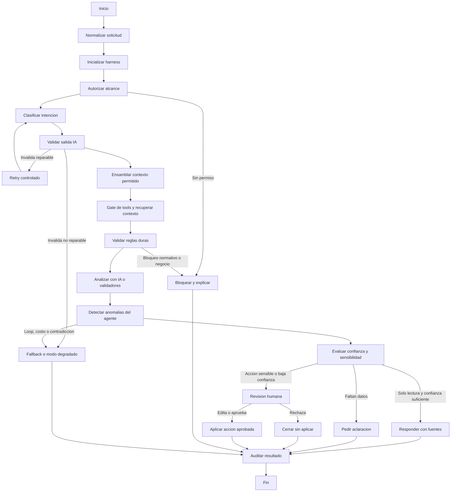
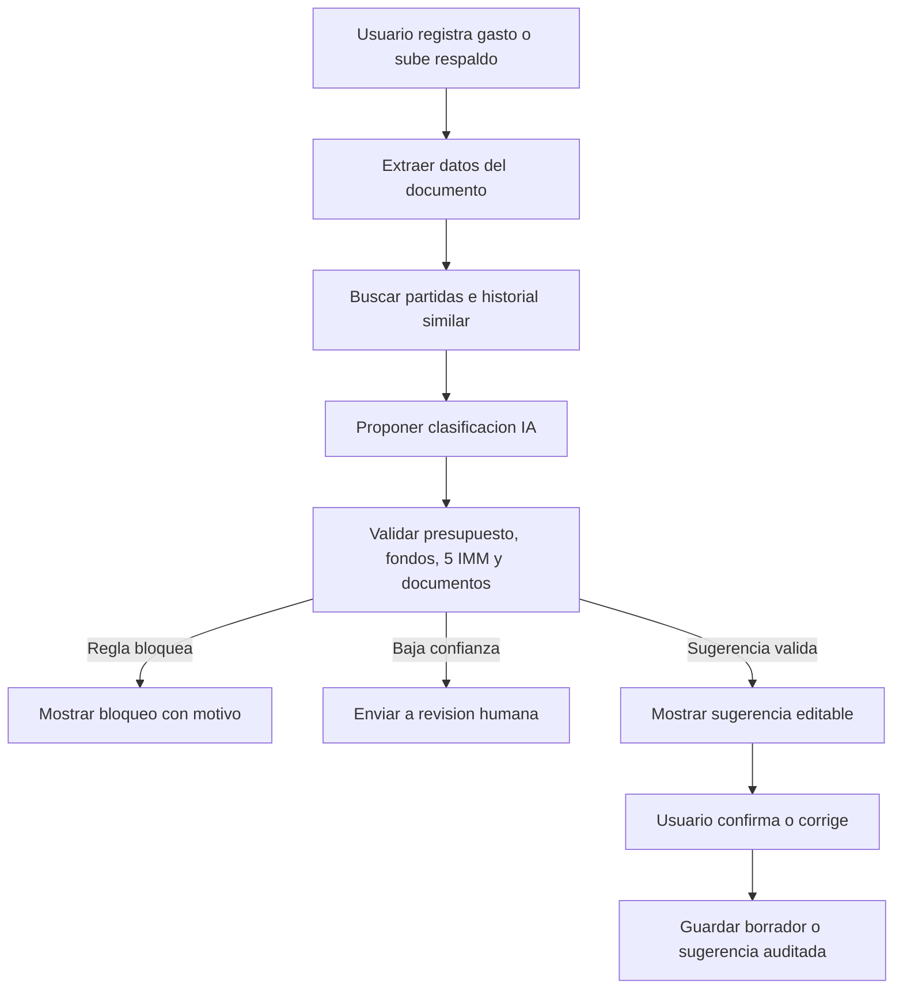
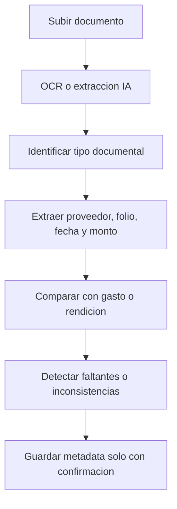
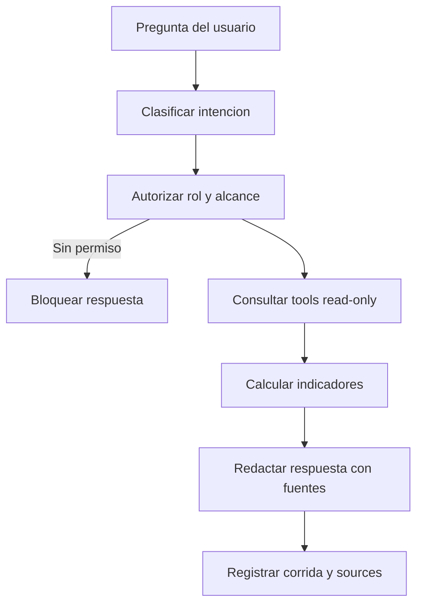
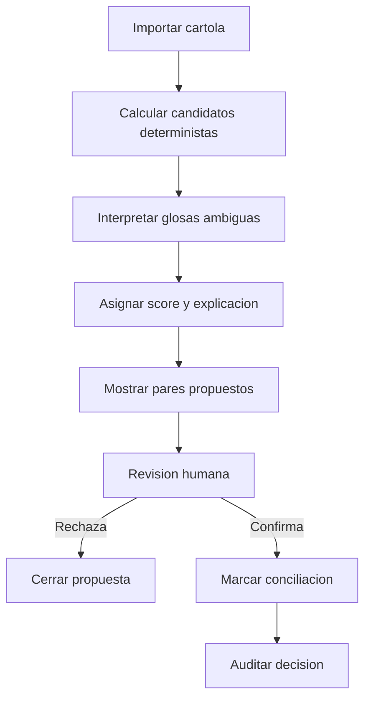
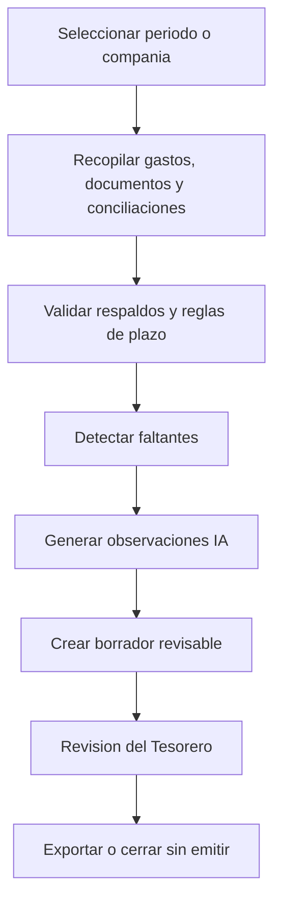

# Resumen Ejecutivo: Arquitectura IA con LangGraph

Documento ejecutivo basado en `docs/08-arte-tecnico-ia-langgraph.md`. Resume el diseno propuesto para incorporar IA al MVP de Tesoreria CBT con LangGraph, manteniendo foco en control, auditoria y operacion segura.

---

## 1. Proposito

La IA del sistema debe funcionar como **copiloto de Tesoreria**, no como autoridad financiera.

Su rol es ayudar a:

- Clasificar gastos y respaldos.
- Extraer datos desde documentos.
- Detectar omisiones, duplicados, diferencias y riesgos.
- Responder consultas operativas con fuentes internas.
- Generar borradores revisables de rendiciones, conciliaciones y resumenes.
- Recomendar acciones trazables para revision humana.

La IA no debe:

- Aprobar gastos.
- Ejecutar pagos.
- Saltarse reglas presupuestarias.
- Modificar registros sensibles sin confirmacion.
- Inventar datos financieros, normativos o documentales.
- Usar informacion fuera del rol del usuario.

Regla central:

> La IA propone, el sistema valida, la persona decide.

---

## 2. Enfoque Arquitectonico

LangGraph se usa para modelar flujos auditables, no para construir un chatbot libre. La solucion debe operar con workflows definidos, checkpoints, validadores, herramientas controladas y puntos de revision humana.

La arquitectura se organiza en cinco planos:

| Plano | Responsabilidad |
|---|---|
| Conversacion | Experiencia visible: asistente, formularios, alertas, borradores y explicaciones |
| Orquestacion | LangGraph coordina nodos, estados, rutas, checkpoints e interrupts |
| Herramientas | Tools controladas para consultar, validar, analizar o proponer cambios |
| Control | Permisos, auditoria, costos, limites, monitoreo y fallback |
| Agent Harness | Capa que gobierna el comportamiento del agente, tools, contexto y salidas |

---

## 3. Capa de Agent Harness

El **Agent Harness** es la capa de control alrededor del modelo, LangGraph y las tools. Su objetivo es reducir autonomia no deseada del LLM y hacer que cada ejecucion sea gobernable, observable y evaluable.

Responsabilidades principales:

- Definir que modelo se puede usar por flujo.
- Limitar costo, tokens, tiempo, iteraciones y tool calls.
- Construir contexto minimo suficiente y autorizado.
- Validar salidas estructuradas del modelo.
- Bloquear tools fuera de allowlist.
- Detectar loops, abuso de tools, contradicciones y baja confianza.
- Activar fallback, modo degradado o revision humana.
- Registrar trazabilidad en `ai_runs`, `audit_log` y observabilidad tecnica.

Separacion clave:

| Capa | Decide | No decide |
|---|---|---|
| LLM | Interpretacion, clasificacion, extraccion, resumen y redaccion | Permisos, reglas financieras, aprobaciones o escrituras |
| LangGraph | Orden del flujo, nodos, rutas, checkpoints e interrupts | Validez final de reglas de negocio |
| Agent Harness | Limites, politicas, tools, contexto, fallback y validacion de outputs | Verdad financiera o autorizacion final |
| Backend | Permisos, reglas duras, transacciones, auditoria y escrituras | Interpretacion libre de lenguaje natural |

---

## 4. Principios de Control

El diseno se sostiene en estos principios:

- Las reglas criticas viven fuera del modelo.
- Toda respuesta financiera debe tener fuentes internas o declarar limitacion.
- Toda tool aplica permisos y alcance en backend.
- Ninguna escritura ocurre sin revision humana.
- Los documentos subidos son contenido no confiable.
- El modelo no recibe acceso libre a SQL, shell, HTTP ni escritura generica.
- Todo flujo deja trazabilidad reconstruible.
- Si hay conflicto entre IA y validador determinista, gana el validador.

---

## 5. Estado Auditable

Cada corrida IA debe tener un estado persistente y reconstruible.

Campos principales:

| Campo | Proposito |
|---|---|
| `run_id` | Identificador unico de la corrida |
| `thread_id` | Continuidad de conversacion o workflow |
| `user_context` | Usuario, rol, compania y permisos efectivos |
| `intent` | Intencion clasificada |
| `input_payload` | Pregunta, documento, gasto o evento inicial |
| `domain_context` | Datos internos recuperados |
| `policy_context` | Reglas aplicables |
| `tool_calls` | Tools ejecutadas y resultados resumidos |
| `findings` | Hallazgos del flujo |
| `confidence` | Confianza por resultado relevante |
| `proposed_actions` | Acciones sugeridas, nunca aplicadas automaticamente |
| `human_review` | Decision humana, comentario y fecha |
| `audit_trace` | Nodos, modelos, errores, costos y checkpoints |

Para produccion se agrega versionado de comportamiento:

- `graph_version`
- `prompt_version`
- `tool_registry_version`
- `model_policy_version`
- `guardrail_policy_version`
- `context_policy_version`

---

## 6. Workflow Maestro

El workflow maestro controla cualquier solicitud IA, desde una consulta simple hasta una propuesta de accion.

Puntos clave:

- La clasificacion puede usar IA, pero el ruteo critico se valida.
- El contexto se recupera con tools autorizadas.
- Las reglas duras se ejecutan antes de proponer acciones.
- Toda accion sensible pasa por revision humana.
- Todo resultado queda auditado.

---

## 7. Workflows Prioritarios

### 7.1 Clasificacion Inteligente de Gastos

Objetivo: sugerir partida, fuente de fondos, tipo de gasto, documentos requeridos y riesgos antes de enviar a aprobacion.

Control principal: la IA no aprueba gastos ni descuenta presupuesto.

### 7.2 Lectura Inteligente de Documentos

Objetivo: transformar respaldos en datos estructurados y advertencias de completitud.

Control principal: el contenido del documento se trata como dato no confiable, no como instruccion.

### 7.3 Asistente Read-Only de Tesoreria

Objetivo: responder preguntas operativas sobre presupuesto, gastos, banco, alertas y rendiciones.

Control principal: no usar text-to-SQL libre en la primera version; solo tools acotadas.

### 7.4 Conciliacion Bancaria Asistida

Objetivo: proponer coincidencias entre movimientos bancarios y gastos aprobados.

Control principal: la conciliacion no modifica montos ni fechas.

### 7.5 Rendicion Asistida

Objetivo: preparar una rendicion completa, detectar faltantes y generar resumen ejecutivo.

Control principal: la completitud documental la decide el validador, no el modelo.

---

## 8. Tools Propuestas

Las tools son la unica via de acceso de la IA al ERP.

Categorias:

| Categoria | Ejemplos |
|---|---|
| Lectura | Presupuesto, gastos, alertas, banco, rendiciones, auditoria |
| Calculo y validacion | Presupuesto disponible, ruta de aprobacion, documentos requeridos, duplicados |
| Analisis IA | Extraccion documental, clasificacion de gasto, resumen financiero |
| Escritura controlada | Crear borrador, guardar sugerencia, guardar metadata, crear alerta |

Restricciones:

- Toda tool valida permisos en backend.
- Toda tool tiene schema de entrada y salida.
- Toda tool de escritura requiere `human_checkpoint`.
- Toda escritura debe ser idempotente.
- No hay tools genericas de SQL o escritura libre.

---

## 9. Guardrails Operacionales

Controles minimos para produccion:

| Control | Regla |
|---|---|
| Iteraciones | Limite por flujo y subgrafo |
| Tool calls | Maximo por corrida y allowlist por flujo |
| Timeouts | Diferenciados por nodo y tool |
| Retries | Solo errores transitorios o salida estructurada reparable |
| Fallback | Mantiene o reduce riesgo; nunca aumenta autonomia |
| Costos | Presupuesto por corrida, modulo y rol |
| Contexto | Minimo suficiente, autorizado y con fuentes |
| Versionado | Prompts, modelos, schemas, tools, grafos y politicas |

Deteccion de anomalias:

- Tool repetida sin cambio de argumentos.
- Intento de tool fuera de allowlist.
- Salida IA sin schema valido.
- Respuesta financiera sin fuentes.
- Propuesta que contradice un validador.
- Baja confianza sin revision humana.
- Prompt injection en documentos.

---

## 10. Evaluacion Continua

La evaluacion debe ser parte del ciclo de desarrollo y operacion.

Metricas recomendadas:

- Tasa de salidas con schema valido.
- Tasa de respuestas con fuentes.
- Casos bloqueados por permisos.
- Intentos de escritura sin checkpoint.
- Sugerencias aceptadas, editadas y rechazadas.
- Latencia p95 por flujo.
- Costo por corrida exitosa.
- Regresiones por version de comportamiento.

Suites minimas:

- Clasificacion de gastos.
- Lectura de documentos.
- Consultas read-only.
- Conciliacion.
- Rendiciones.
- Permisos y fuga de datos.
- Prompt injection.
- Reglas criticas: 5 IMM, partidas bloqueadas, fondos restringidos y presupuesto no aprobado.

Criterios de salida:

- Cero escrituras sin revision humana.
- Cero fugas entre roles o companias.
- Reglas duras siempre prevalecen.
- Respuestas financieras siempre citan fuentes o declaran limitacion.
- Casos de baja confianza escalan correctamente.

---

## 11. Auditoria y Observabilidad

Cada corrida debe ser reconstruible.

Registro minimo:

- Usuario, rol y modulo origen.
- Entidad principal.
- Nodos ejecutados.
- Tools llamadas.
- Resultado de validadores.
- Modelo y version de comportamiento.
- Tokens, costo y latencia.
- Fuentes usadas.
- Decision humana.
- Estado final.

`ai_runs` y `audit_log` son la auditoria operativa del ERP. Herramientas como Langfuse pueden usarse para observabilidad tecnica, pero no deben reemplazar la auditoria interna.

---

## 12. Roadmap Ejecutivo

| Fase | Objetivo | Resultado |
|---|---|---|
| IA-0 | Fundacion read-only, auditoria, permisos y tools seguras | Consultas sin riesgo de modificar datos |
| IA-1 | Gastos y documentos | Menos carga manual y mejores sugerencias de clasificacion |
| IA-2 | Asistente operativo | Preguntas financieras con fuentes y trazabilidad |
| IA-3 | Conciliacion y rendiciones | Menor tiempo de cierre y preparacion de rendiciones |
| IA-4 | Analitica avanzada | Alertas predictivas y gestion preventiva |

Primera experiencia recomendada:

1. Boton "Analizar con IA" en nuevo gasto.
2. Panel "Preguntar a Tesoreria" read-only.
3. Boton "Sugerir conciliacion" en banco.

---

## 13. Decisiones No Negociables

- La IA no aprueba gastos.
- La IA no ejecuta pagos.
- La IA no modifica montos aprobados.
- La IA no desbloquea partidas.
- La IA no elimina documentos ni auditoria.
- Toda escritura sensible requiere usuario autenticado, permiso efectivo, revision humana y auditoria.
- Toda regla financiera critica se valida con codigo.
- Todo flujo debe poder auditarse de punta a punta.

---

## 14. Definicion de Exito

La integracion sera exitosa si:

- Reduce tiempo de registro y revision de gastos.
- Disminuye errores de imputacion presupuestaria.
- Detecta respaldos faltantes antes de rendir.
- Mejora la trazabilidad de decisiones.
- Permite responder preguntas financieras con fuentes.
- No introduce aprobaciones automaticas ni modificaciones invisibles.
- Mantiene control institucional sobre el sistema financiero.

---

## 15. Regla Final

LangGraph no debe operar como un bot conectado libremente a la base de datos.

Debe operar como una **maquina de flujo auditable**, donde la IA participa solo en pasos controlados: interpretar, clasificar, resumir, sugerir y explicar. Las decisiones financieras siguen gobernadas por reglas deterministas y responsables humanos.
